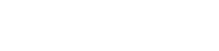

<link rel="preconnect" href="https://fonts.googleapis.com">
<link rel="preconnect" href="https://fonts.gstatic.com" crossorigin>
<link href="https://fonts.googleapis.com/css2?family=Open+Sans&display=swap" rel="stylesheet">

<!--  -->

    
    
Perform advanced NLP with our  no-code solutions on KNIME

    

        

            
Lorem ipsum dolor sit amet consectetur adipisicing elit. Dicta ea, excepturi ducimus incidunt ullam eos neque veniam explicabo enim doloremque asperiores delectus autem nihil minus cupiditate vel culpa. Iure, iste?

        

        

            <iframe width="320" height="215" style="border: 0;"
            src="https://www.youtube.com/embed/tgbNymZ7vqY">
            </iframe>
        

    

    

    <a style="color:#fff; background-color:#3AAFF5">GET YOUR TRIAL</a>
    

